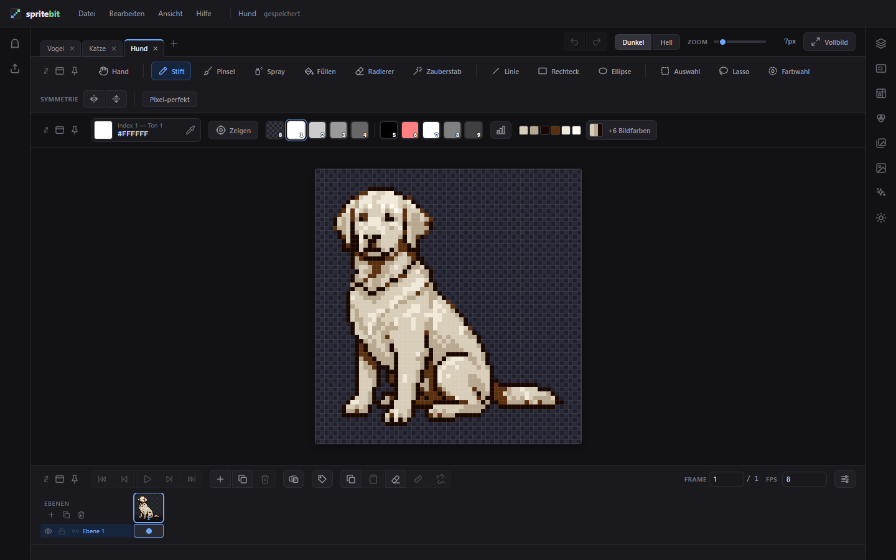

<div align="center">


# spritebit

**Pixel-Art-Editor für Sprites — im Browser, offline, ohne Konto.**
Zeichnen, animieren, Paletten bauen und als Bild, GIF oder Code exportieren.

[**▶ Im Browser öffnen**](https://spritebit.at/editor.html) ·
[**⬇ Desktop-App**](https://github.com/spritebit/spritebit-rs/releases/latest) ·
[Website](https://spritebit.at) ·
[Handbuch](docs/handbuch.md) ·
[Mitmachen](CONTRIBUTING.md)




</div>

---

## Was spritebit kann

<table>
<tr>
<td width="50%" valign="top">

**🎨 Zeichnen**
- Stift, Pinsel, Spray, Füllen, Radierer, Zauberstab
- Linie, Rechteck, Ellipse — Kontur oder gefüllt
- **Clean Stroke**: saubere 1-Pixel-Striche ohne doppelte Eckpixel
- **Symmetrie** an einer oder beiden Achsen
- Auswahl, Lasso, Farbwahl — ausschneiden, verschieben, drehen
- Pipette, Hand, Zoom auf den Mauszeiger, Finger-Gesten

</td>
<td width="50%" valign="top">

**🎞️ Animieren**
- **Timeline als Raster**: Ebenen × Frames, wie in gängigen Animations-Programmen
- Zellen kopieren, verschieben, **verknüpfen**
- **Tags** mit Name, Farbe und Richtung (vorwärts, rückwärts, Ping-Pong)
- **Onion Skin** mit Farben, Deckkraft und mehreren Frames
- Dauer je Frame, FPS, Abspielen in der Zeichenfläche

</td>
</tr>
<tr>
<td valign="top">

**🌈 Farben**
- Paletten bis 255 Farben, 17 eingebaute, eigene anlegen
- Farbzeile ziehen oder **nach Farbstufen sortieren**
- **Bild → Palette**: Fotos auf 4 bis 255 Farben reduzieren
- **Licht**: Lichtquelle wählen, Kanten aufhellen, Schlagschatten werfen
- Outline, Glätten, Hintergrund entfernen

</td>
<td valign="top">

**📦 Exportieren**
- **PNG** (1×–32×), **PDF**, **GIF**, **Spritesheet** mit JSON-Atlas
- **9 Code-Formate**: TS, JS, JSON, Spiel-JSON, SVG, CSS, C, Python, Text
- Alles lässt sich auch **wieder importieren**
- Mehrere Frames auf einmal, GIF je Tag

</td>
</tr>
<tr>
<td valign="top">

**🧰 Arbeitsplatz**
- **Reiter** für geöffnete Sprites, wie man es aus Grafikprogrammen kennt
- Panels anpinnen, lösen, frei verschieben — die Anordnung bleibt
- Ebenen mit Deckkraft, Sperre und Sichtbarkeit
- Schablone: Foto als Vorlage zum Abpausen
- Hilfslinien und Figuren-Proportionen (2–8 Kopfhöhen)

</td>
<td valign="top">

**🔒 Deine Daten bleiben bei dir**
- Läuft komplett im Browser, **nichts wird hochgeladen**
- Funktioniert **offline**, installierbar als App
- Speichert automatisch (IndexedDB), Projektdatei als Backup
- Sprites bis 1024 × 1024 Pixel
- Am Handy bedienbar

</td>
</tr>
</table>

---

## Loslegen

**Online:** [spritebit.at/editor.html](https://spritebit.at/editor.html) öffnen — fertig.
Kein Konto, keine Installation. Chrome und Edge bieten in der Adressleiste
„Installieren“ an, dann startet spritebit wie ein eigenes Programm.

**Lokal:** Es gibt keinen Build-Schritt und keine Abhängigkeiten zur Laufzeit.
ES-Module brauchen nur einen HTTP-Server (`file://` geht nicht):

```bash
git clone https://github.com/spritebit/sprite-editor.git
cd sprite-editor
python -m http.server 8000      # oder: npm run serve
```

Dann `http://localhost:8000/` öffnen — die Startseite; der Editor liegt unter `editor.html`.

**Desktop-App (Windows):** Die native Fassung in Rust
([spritebit-rs](https://github.com/spritebit/spritebit-rs)) gibt es als
[**Download**](https://github.com/spritebit/spritebit-rs/releases/latest/download/spritebit-windows-x64.zip) —
ZIP entpacken, `spritebit.exe` starten. Windows warnt beim ersten Start vor einem unbekannten
Herausgeber („Weitere Informationen“ → „Trotzdem ausführen“), weil die Datei nicht signiert ist.
Alle Versionen stehen unter [Releases](https://github.com/spritebit/spritebit-rs/releases).

---

## Code-Export

Jeder Sprite lässt sich als Code ausgeben — mit Farben, mit allen Frames, und verlustfrei
wieder einlesbar.

| Format | Datei | Wofür |
|---|---|---|
| TypeScript | `.ts` | `number[][]` + Palette als `Record<number, string>` |
| JavaScript | `.js` | dasselbe ohne Typen |
| JSON | `.json` | sprachneutral, für eigene Pipelines |
| JSON (Spiel) | `.json` | flaches `data`-Array, Material je Farbe — [C#-Loader](docs/csharp-loader.md) |
| SVG | `.svg` | Vektorgrafik, animiert per CSS |
| CSS | `.css` | der Sprite auf einem einzigen Element (`box-shadow`) |
| C-Header | `.h` | `uint8`-Indizes + Palette für Mikrocontroller und LED-Matrix |
| Python | `.py` | für Pygame, Pillow und Skripte |
| Text-Raster | `.txt` | ein Zeichen pro Pixel — für Diffs und Doku |

```ts
export const HELD: number[][] = [
  [0, 5, 5, 0],
  [5, 2, 2, 5],
  [0, 5, 5, 0],
];
```

---

## Tastenkürzel

<details>
<summary>Die wichtigsten Kürzel anzeigen</summary>

| Taste | Wirkung |
|---|---|
| `P` `B` `S` `F` `E` `W` | Stift · Pinsel · Spray · Füllen · Radierer · Zauberstab |
| `I` `R` `O` | Linie · Rechteck · Ellipse |
| `A` `L` `K` | Auswahl · Lasso · Farbwahl |
| `H` | Hand — Ansicht verschieben |
| `0`–`9` | Farbe wählen |
| Rechtsklick | Radieren |
| `Alt` + Klick | Pipette |
| `Strg` + Mausrad | Zoom auf den Mauszeiger |
| `Leertaste` + Ziehen | Bild verschieben |
| `Strg+Z` / `Strg+Y` | Rückgängig / Wiederholen |
| `Strg+A` / `C` / `X` / `V` | Alles · Kopieren · Ausschneiden · Einfügen |
| `Enter` | Animation abspielen / anhalten |
| `,` / `.` | Voriger / nächster Frame |
| `G` | Hilfslinien ein / aus |
| `Strg+S` / `Strg+O` | Projekt sichern / öffnen |
| `F1` | Hilfe |

Alle Kürzel stehen im [Handbuch](docs/handbuch.md#tastenkürzel) und im Editor unter **Hilfe** (`F1`).

</details>

---

## Unter der Haube

- **Reines Frontend:** HTML, CSS und ES-Module — kein Framework, kein Bundler, kein Build.
  Die Dateien im Repo sind genau die, die der Browser lädt.
- **Ohne Fremdcode zur Laufzeit:** GIF-Encoder, ZIP, Code-Formate, Import-Parser — alles
  selbst geschrieben. Einzige Ausnahme ist jsPDF, lokal in `vendor/`.
- **Typgeprüft ohne TypeScript-Build:** JSDoc-Typen, geprüft mit `npm run check`.
- **Getestet:** über 170 Tests mit dem eingebauten Test-Runner von Node, `npm test` —
  ohne vorher etwas zu installieren.
- **Offline-fähig:** Service Worker mit „Netz zuerst, Cache als Rückfall“ und Update-Band.

Wie das alles zusammenhängt, steht in [CONTRIBUTING.md](CONTRIBUTING.md).

---

## Mitmachen

Fehler gefunden, Idee gehabt? Gern als [Issue](https://github.com/spritebit/sprite-editor/issues).
Pull Requests sind willkommen — vorher bitte kurz [CONTRIBUTING.md](CONTRIBUTING.md) lesen:
es gibt nur wenige Regeln, aber die halten das Projekt zusammen.

```bash
npm test        # alle Tests
npm run check   # Typprüfung
```

---

## In English

**spritebit** is a free, open-source pixel art editor for sprites that runs entirely in your
browser — offline, no account, nothing uploaded. Draw clean 1-pixel strokes (Clean Stroke) with symmetry,
animate on a layer × frame timeline with linked cels, tags and onion skin, build palettes,
add light and drop shadows, and export to PNG, GIF, spritesheets or nine code formats
(TypeScript, JSON, SVG, CSS, C, Python …). The UI is available in German, English and Austrian
German. [Open the editor →](https://spritebit.at/editor.html)

---

## Lizenz

[MIT](LICENSE) © 2026 Marco Jan — nutzen, ändern und weitergeben ist erlaubt, auch kommerziell,
solange der Lizenzhinweis mitkommt. **Was du mit spritebit zeichnest, gehört dir.**
